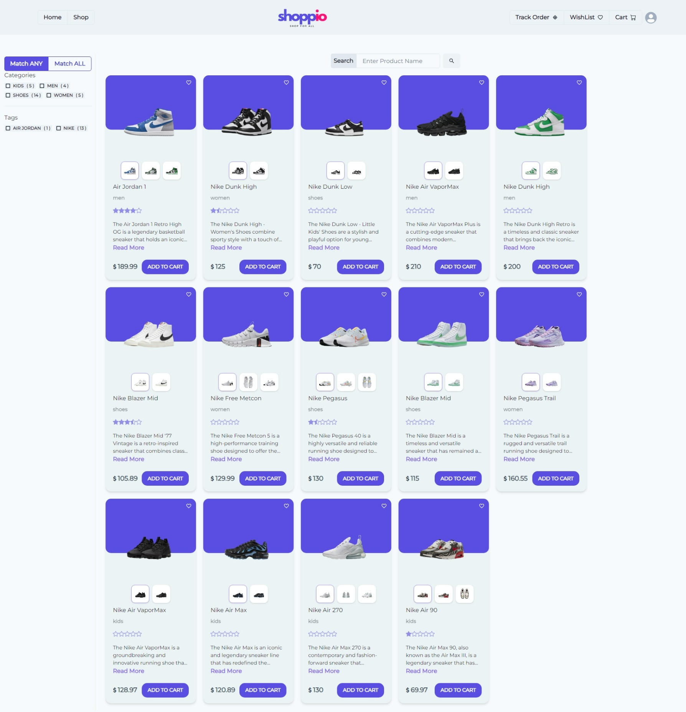

# Shoppio - Your One-Stop E-Commerce Platform 🛍️

  
  
  
  

      

Shoppio is a full-featured e-commerce platform that empowers both customers and vendors. Customers can conveniently browse and purchase products from a wide range of vendors, personalize their profiles, and enjoy secure payments. Vendors can expand their reach, manage their products and orders, and track performance effortlessly.

## Table of Contents
- [Getting Started](#getting-started-)
- [Features](#features-)
- [Project Structure](#project-structure-)
- [Client](#client)
- [Server](#server)
- [License](#license-)

## Getting Started 🚀

1. Clone the repository.
2. Navigate to the client and server folders separately and run `npm install` to install dependencies.
3. Set up your database and update connection details in `server/db/connect.js`.
4. Create a `.env` file in the server folder and add necessary environment variables.
5. Run the both server and client with `npm start` in the server folder.

## Features 🌟

- **User Features:**
  - Browse products conveniently.
  - Create a personalized profile.
  - Secure payments and checkout process.
  - Track orders and manage wishlists.

- **Vendor Features:**
  - Expand business reach.
  - Easily add and manage products.
  - Monitor order and sales statistics.

## Project Structure 📂

### Client
The client-side code is organized as follows:

- **src/assets:** Contains images used in the project.
- **src/wrappers:** Includes wrapper components, such as the Landing page.
- **src/components:** Houses various components categorized under `site`, `user`, and `vendor`.
- **src/context:** Manages global state using React Context API.
- **src/pages:** Defines different pages of the application.
- **src/utils:** Includes utility functions used across the application.
- **src/App.js:** The main entry point for the client-side application.

### Server
The server-side code is structured as follows:

- **server/controllers:** Handles business logic for authentication, customer, site, and vendor functionalities.
- **server/db:** Manages database connection.
- **server/errors:** Custom error classes.
- **server/middleware:** Contains middleware functions, such as authentication and error handling.
- **server/models:** Defines database models for Notification, Order, Product, ProductReview, User, and WishList.
- **server/routers:** Routes for authentication and different user roles.
- **server/.env:** Environment variables for the server.
- **server/server.js:** Main entry point for the server.

## Technologies Used 🤖

### Client

- **Chakra UI**: A simple, modular component library for React applications.
- **Emotion**: A popular CSS-in-JS library.
- **Fontsource**: Provides self-hosted fonts for better performance.
- **Axios**: A promise-based HTTP client for making API requests.
- **Framer Motion**: A library for creating smooth animations.
- **React Icons**: Icons library for React.
- **React Router DOM**: Declarative routing for React.js.
- **Recharts**: A charting library for React based on D3.
- **Styled Components**: A CSS-in-JS library for styling React components.
- **UUID**: A library for generating unique identifiers.
- **Web Vitals**: Metrics for measuring the performance of web pages.

### Server

- **Mongoose**: An ODM (Object Data Modeling) library for MongoDB and Node.js.
- **AWS SDK for S3**: A software development kit for Amazon Simple Storage Service.
- **Bcrypt.js**: A library for hashing and salting passwords.
- **Dotenv**: A zero-dependency module for loading environment variables.
- **Jsonwebtoken**: A library for generating JSON Web Tokens (JWT).
- **Mime Types**: A library for mapping file extensions to MIME types.
- **Morgan**: A HTTP request logger middleware for Node.js.
- **Multiparty**: A streamable form-data parser for Node.js.
- **Validator**: A library for string validation and sanitization.
- **Concurrently**: A utility to run multiple commands concurrently.
- **Nodemon**: A tool to automatically restart the server on file changes.

## Screenshots

| Home | Shop | Product-Details |
|----------|----------|----------|
|  |  |  |
| Cart | My Orders (Customer) | Track Order |
|  |  |  |
| Wishlist | Vendor Dashboard | Create Product (Vendor) |
|  |  |  |
| Vendor Orders | Vendor's Page For Customers | Vendor Profile |
|  |  |  |

## License 📄

This project is licensed under the [MIT License](LICENSE).
